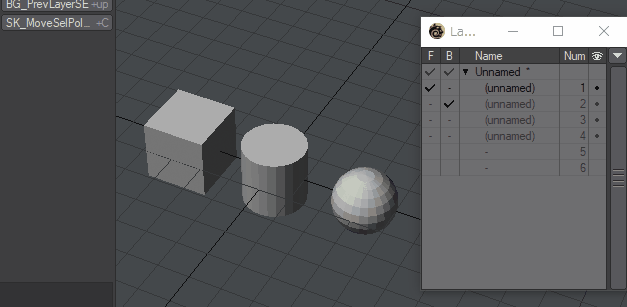

# MoveSelPolyBG

 日本語 / [English](README.md)

LightwaveのModeler用Pythonスクリプトです。

## Overview

Move the selected polygon to the background layer.

## Download

[SK_MoveSelPolyBG.zip](SK_MoveSelPolyBG.zip)

「名前をつけてリンク先を保存」でダウンロード。zipファイルに含まれるスクリプト(.pyファイル)を任意のフォルダへ移動してAdd Pluginしてください。

## How To Use

背景レイヤへ移動したいポリゴンを選択してプラグインを実行してください。

ポリゴンを選択していない場合は、全てのポリゴンを背景レイヤへ移動します。

複数のオブジェクトには対応していません。

背景レイヤは１つだけ選択してください。

## Change log

2018.12.15 (ver.0.90)

- 公開

## Donation
If this project helps shorten the working time, you can give me a cup of coffee :)

