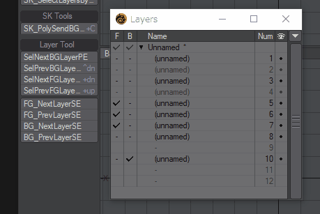

# SelectLayerSE

 [日本語](README_jp.md) / English

Lightwave Modeler Python Script, There are 4 scripts.

## Overview

Move the foreground layer selection next and previous while keeping the background layer selection.

Move the background layer selection next and previous while keeping the foreground layer selection.

The script does not select layers that do not have a mesh.

The script can move only one layer.

## Download

[SelectLayerSE.zip](SelectLayerSE.zip)

Download the zip file by "Save as..", unzip zip file and add plugin (4 files).

## How To Use

### SK_FG_NextLayerSE

Move the layer selected as the foreground to the next layer.

### SK_FG_PrevLayerSE

Move the layer selected as the foreground to the previous layer.

### SK_BG_NextLayerSE

Move the layer selected as the background to the next layer.

### SK_BG_PrevLayerSE

Move the layer selected as the background to the previous layer.

## Change log

2018.12.13 (ver.0.90)

- Release

## Donation
If this project helps shorten the working time, you can give me a cup of coffee :)

