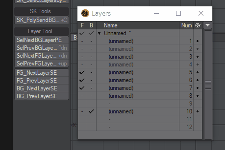

# SelectLayerSE

 日本語 / [English](README.md)

LightwaveのModeler用Pythonスクリプトです。４つのスクリプトがあります。

## Overview

背景レイヤーの選択を保持したまま、前景レイヤーの選択を前後に移動します。

前景レイヤーの選択を保持したまま、背景レイヤーの選択を前後に移動します。

メッシュが存在しないレイヤーは選択しません。

移動するレイヤーは１つだけ選択してください。

## Download

[SelectLayerSE.zip](SelectLayerSE.zip)

「名前をつけてリンク先を保存」でダウンロード。zipファイルに含まれる4つのスクリプト(.pyファイル)を任意のフォルダへ移動してAdd Pluginしてください。

## How To Use

### SK_FG_NextLayerSE

フォアグラウンドレイヤーの選択を次に移動します。

### SK_FG_PrevLayerSE

フォアグラウンドレイヤーの選択を前に移動します。

### SK_BG_NextLayerSE

バックグラウンドレイヤーの選択を次に移動します。

### SK_BG_PrevLayerSE

バックグラウンドレイヤーの選択を前に移動します。

## Change log

2018.12.13 (ver.0.90)

- 公開
