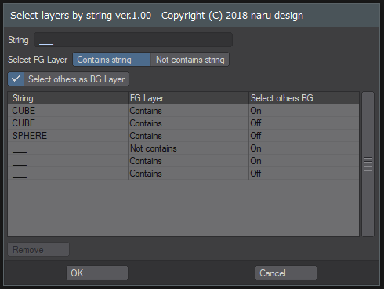

# SelectLayersByString

English / [Japanese](README_jp.md)

Lightwave Modeler Python Script

## Overview

Search the layer name as a character string and select the layer that matches the condition.
The search condition you entered remains as history. You can select a layer using history.

Layers that do not contain a mesh are not selected.

If there is no layer that can be selected as the foreground layer, an error will result. An error also occurs if there is no mesh in the object.

## Download

[SelectLayersByString.zip](SelectLayersByString.zip)

Download the zip file by "Save as..", unzip zip file and add plugin. Plugin is added as "SK_SelectLayersByString".

## How To Use

### - String :

Specify a character string to search for the layer name.

### - Select FG Layer :

Specify whether to select the layer containing the string as the foreground layer or the layer not included.

### - Select others as BG Layer :

Select the layer that was not selected as the foreground layer as the background layer.

### - History list

Click history to recall the search condition.

### - Remove Button

Deletes the selected history.

## Change log

2018.12.10 (ver.1.01)

Set the previous search condition as default condition

2018.12.9 (ver.1.0)

Release

## Donation
If this project helps shorten the working time, you can give me a cup of coffee :)

