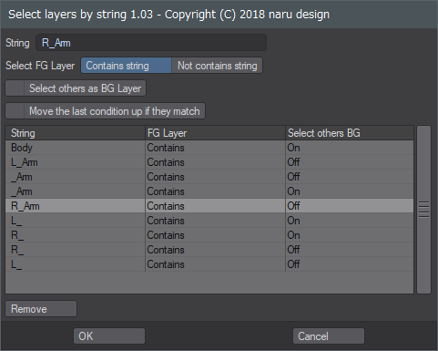

# SelectLayersByString

 日本語 / [English](README.md)

LightwaveのModeler用Pythonスクリプトです。

## Overview

レイヤー名を文字列で検索して、条件に一致するレイヤーを選択します。
入力した検索条件は履歴として残ります。履歴を使ってレイヤー選択できます。

メッシュが含まれないレイヤーは選択の対象としません。

フォアグラウンドレイヤーとして選択できるレイヤーが無い場合、エラーとなります。
オブジェクトにメッシュが存在しない場合もエラーとなります。

## Download

[SelectLayersByString.zip](SelectLayersByString.zip)

「名前をつけてリンク先を保存」でダウンロード。zipファイルに含まれるSelectLayersByString.pyファイルを任意のフォルダへ移動してAdd Pluginしてください。SK_SelectLayersByStringとして登録されます。

## How To Use

### - String :

レイヤー名を検索する文字列を指定します。

### - Select FG Layer :

文字列が含まれているレイヤーをフォアグラウンドレイヤーとして選択するか、含まれていないレイヤーを選択するかを指定します。

Specify whether to select the layer containing the string as the foreground layer or the layer not included.

### - Select others as BG Layer :

フォアグラウンドレイヤーとして選択されなかったレイヤーをバックグラウンドレイヤーとして選択します。

### - Move the last condition up if they match :

一致する履歴があった時、自動的に履歴の最初へ移動するか否か。履歴のソートを停止するにはオフにしてください。

### - History list

履歴をクリックすると検索条件を呼び出します。

### - Remove Button

選択されている履歴を削除します。

## Change log

2018.12.11 (ver.1.02)

- 追加：自動的に履歴を先頭へ移動することを選択できるようにした

2018.12.10 (ver.1.01)

- 変更：前回の検索条件をデフォルトの条件としてセット

2018.12.9 (ver.1.0)

- リリース

## Donation
If this project helps shorten the working time, you can give me a cup of coffee :)

